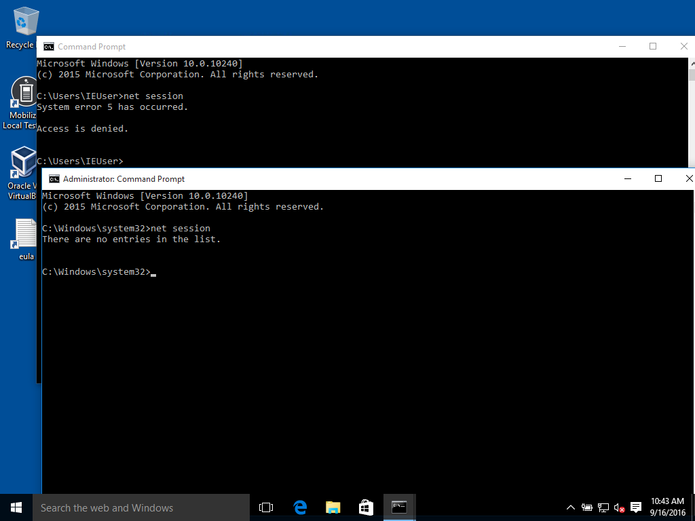

Download and install git https://git-scm.com/downloads<br>
Download and install VirtualBox https://www.virtualbox.org/wiki/Downloads<br>
Download and install vagrant https://www.vagrantup.com/downloads.html<br>

Launch the git shell and run
```
git clone https://github.com/fossology/fossology.git
cd fossology
git config --local core.autocrlf false
git rm --cached -r .
git reset --hard
```

Check if port 8081 or 5432 are already being used. 
```
netstat -ano
  TCP    0.0.0.0:8081           0.0.0.0:0              LISTENING    33411
  TCP    0.0.0.0:5432           0.0.0.0:0              LISTENING    33411
```

If the ports are being used, edit Vagrantfile in the fossology directory that was created above.

You can also use the process IDs listed at the end of the netstat output to see if the listening process can be shutdown.

Search for the following lines
```
config.vm.network "forwarded_port", guest: 80, host: 8081
config.vm.network "forwarded_port", guest: 5432, host: 5432
```
and replace 8081 or 5432 with a ports that are available.<br>
Run cmd as Administrator (Find cmd in the Start Menu, it's usually under Accessories, right click, select Run as Administrator). If cmd is running as Administrator, you should see "Administrator" in the title of the cmd window as shown in the screenshot below.<p>
To validate cmd is running as Administrator, run
```
net session
```
If the command indicates "Access is denied.", cmd is not running as Administrator and will need to be restarted as per the steps above. See the image below for a failed and a successful test.
<p>
<p>
After validating cmd is running as Administrator, you can start Fossology with the following commands (this process may take 10-30 minutes).
```
cd fossology
vagrant up
```
After those steps are finished running, open a web browser and enter the following URL to access the Fossology web application, making sure to update the port number in the URL so it matches the value configured above:<br>
[http://localhost:8081/repo/](http://localhost:8081/repo/)<br>
Login as with the username fossy and the password fossy<br>
Create an archive with all your source code using one of the file formats listed by Fossology. It may be necessary to use multiple files if a single file would exceed the maximum size listed by Fossology.<br>
Select Upload->From File and upload your archive.<p>
The above process will upload your source code to the Fossology virtual machine running locally (your source code will not be sent anywhere else) and begin scanning for references to third party libraries. This process can take quite a while.<br>
After the scanning process is complete, it is necessary to review all of the findings in the Fossology web apoplication and for each, determine if the tool has identified a piece of third party code, or if it has matched an internal resource.<p>
Additional information on using FOSSology can be found in the [http://archive15.fossology.org/projects/fossology/wiki/Quickstart](FOSSology Quickstart Guide)

## Troubleshooting
**Problem:** vagrant up fails due to the virtual machine not starting with an error related to VT-x.<br>
**Solution:** VT-x is a bios setting that allows for virtualization. This error is usually due to VT-x not being enabled in the BIOS. The steps to enable VT-x vary from device to device so Google'ing for the steps is usually the best approach.

**Problem:** On accessing Fossology using the URL listed above, you receive a message:
Forbidden

You don't have permission to access /repo/ on this server.

**Solution:**
cmd was not run as Administrator. Follow the steps above to run cmd as Administrator. 

From the fossology directory, run
```
vagrant destroy
vagrant up
```
This should finish without any errors.
