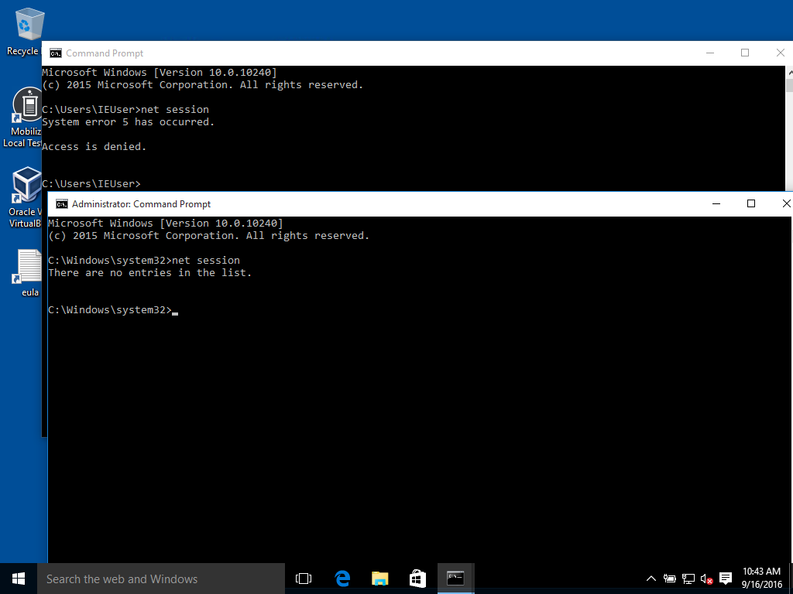
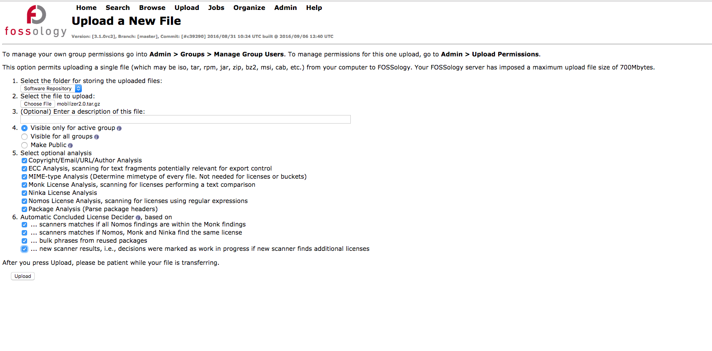
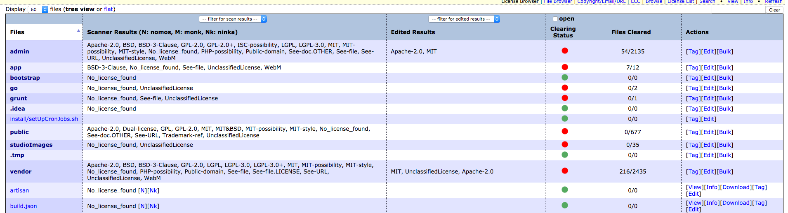
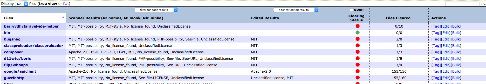
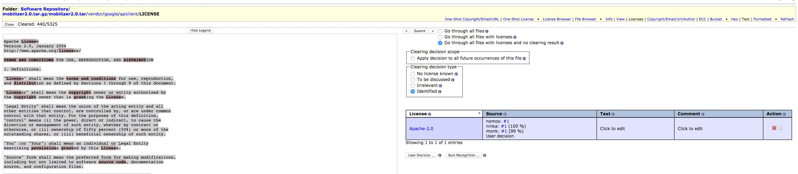
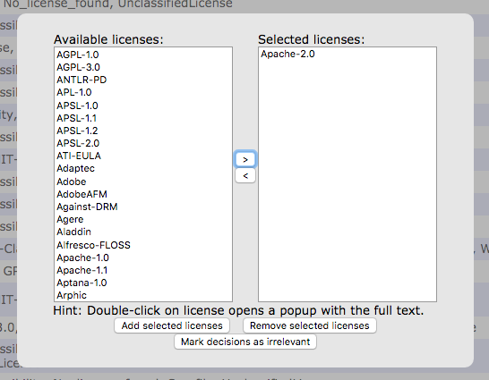
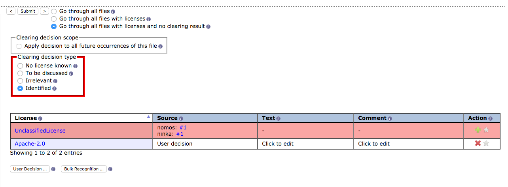

## Prerequisites
Download and install git https://git-scm.com/downloads<br>
Download and install VirtualBox https://www.virtualbox.org/wiki/Downloads<br>
Download and install vagrant https://www.vagrantup.com/downloads.html<br>

## Launching Fossology
Launch the git shell and run
```
git clone https://github.com/fossology/fossology.git
cd fossology
git config --local core.autocrlf false
git rm --cached -r .
git reset --hard
```

Check if port 8081 or 5432 are already being used. On Windows, you can run netstat from cmd to check.
```
netstat -ano
  TCP    0.0.0.0:8081           0.0.0.0:0              LISTENING    33411
  TCP    0.0.0.0:5432           0.0.0.0:0              LISTENING    33411
```

If the ports are being used, edit Vagrantfile in the fossology directory that was created above.

You can also use the process IDs listed at the end of the netstat output to see if the listening process can be shutdown.

Search for the following lines
```
config.vm.network "forwarded_port", guest: 80, host: 8081
config.vm.network "forwarded_port", guest: 5432, host: 5432
```
and replace 8081 or 5432 with a ports that are available.<br>
Run cmd as Administrator (Find cmd in the Start Menu, it's usually under Accessories, right click, select Run as Administrator). If cmd is running as Administrator, you should see "Administrator" in the title of the cmd window as shown in the screenshot below.<p>
To validate cmd is running as Administrator, run
```
net session
```
If the command indicates "Access is denied.", cmd is not running as Administrator and will need to be restarted as per the steps above. See the image below for a failed and a successful test.
<p>
<p>
After validating cmd is running as Administrator, you can start Fossology with the following commands (this process may take 10-30 minutes).
```
cd fossology
vagrant up
```
After those steps are finished running, open a web browser and enter the following URL to access the Fossology web application, making sure to update the port number in the URL so it matches the value configured above:<br>
[http://localhost:8081/repo/](http://localhost:8081/repo/)<br>
Login as with the username fossy and the password fossy<br>
## Uploading a file to be scanned
Create an archive with all your source code using one of the file formats listed by Fossology. It may be necessary to use multiple files if a single file would exceed the maximum size listed by Fossology.<br>
Select Upload->From File from the top menu.<br>
Click Choose File and select your source code archive.<br>
Check all the options in the "Select optional analysis" and "Automatic Concluded License Decider" sections.<br>
Your screen should now look like the following:<p>

Press Upload<p>
The above process will upload your source code to the Fossology virtual machine running locally (your source code will not be sent anywhere else) and begin scanning for references to third party libraries. This process can take quite a while.<br>
After the file upload completes, select the Jobs tab at the top of the application and select My Recent Jobs.<br>
Refresh this page until all jobs are complete. This can take a large part of one day depending on the size of your code.<br>
## License Review
After the jobs complete, it is necessary to review the results and "clear" any files for which FOSSology could not automatically determine the appropriate license.<br>
To do this, select Browse from the top menu and select the file that was just scanned.<br>
You should then see a listing of the files that were scanned together with a "clearing status" as shown in the below screenshot.<p>
<p>
The goal of the overall License Review step is to clear each and every file. While this process can take some time when there are thousands of files to review, there are fortunately a couple easy ways to accurately clear files in bulk.<p>
### Clearing results by directory
To begin with, select any directories that clearly contain third party code, such as the vendor directory shown in the previous screenshot.<br>
Select this directory and then attempt to determine the license for each third party module. <br>
For example, selecting the "google/apiclient" directory in the below listing<p>
<p>
contains a LICENSE file that clearly indicates the "google/apiclient" module is licensed under the Apache 2.0 license.<p>
<p>
With this determined, we can now clear this directory in bulk by clicking on Edit to the right of the module name, selecting the appropriate license from the picker, pressing the &gt; button, and then pressing Add Selected License.<p>
<p>
This should clear most of the files under that module (153 out of 156) in this example. To clear the remaining files, select the directory, and review the remaining files that have not been cleared.<p>
<p>
Click View on the first of these files, then in the Licese table, click on the red X for each license that does not apply, which should leave only the license that was previously determined. Select the Identified radio button, select Go through all files with licenses and no clearing result, and press the &gt; button, which should advance you to the next file to be cleared.<p>
<p>
Continue this process until you are advanced to a file in a different directory. <p>
Additional information on using FOSSology can be found in the [FOSSology Quickstart Guide](http://archive15.fossology.org/projects/fossology/wiki/Quickstart)

## Troubleshooting
**Problem:** vagrant up fails due to the virtual machine not starting with an error related to VT-x.<br>
**Solution:** VT-x is a bios setting that allows for virtualization. This error is usually due to VT-x not being enabled in the BIOS. The steps to enable VT-x vary from device to device so Google'ing for the steps is usually the best approach.

**Problem:** On accessing Fossology using the URL listed above, you receive a message:
Forbidden

You don't have permission to access /repo/ on this server.

**Solution:**
cmd was not run as Administrator. Follow the steps above to run cmd as Administrator. 

From the fossology directory, run
```
vagrant destroy
vagrant up
```
This should finish without any errors.
